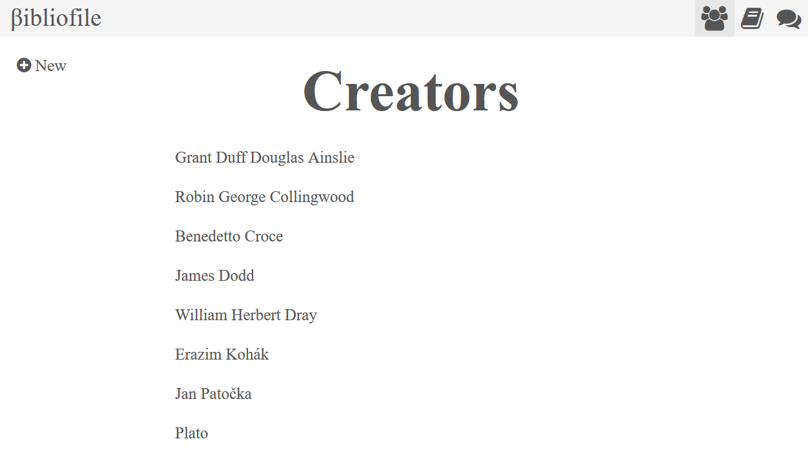
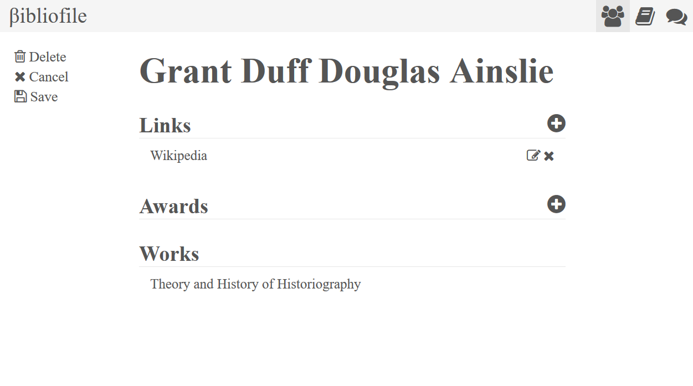
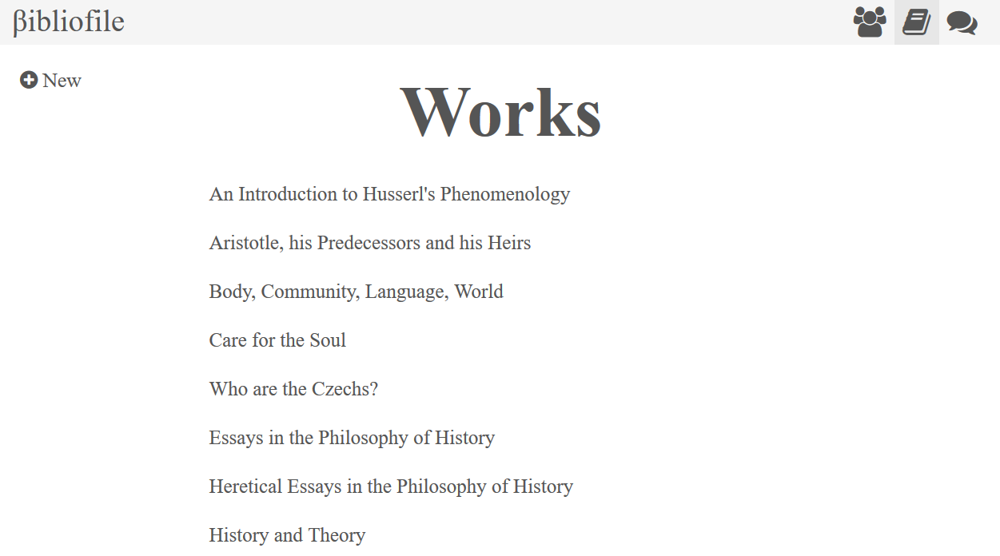
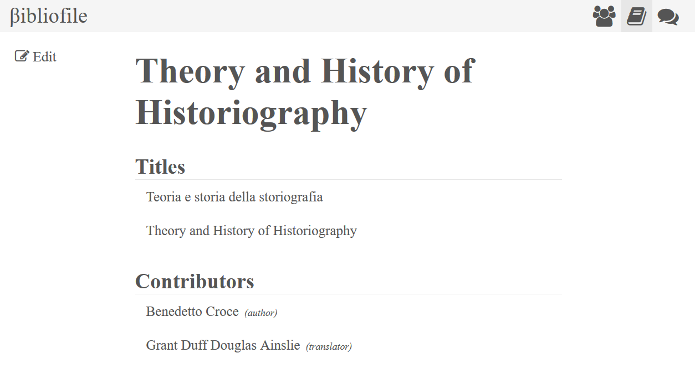
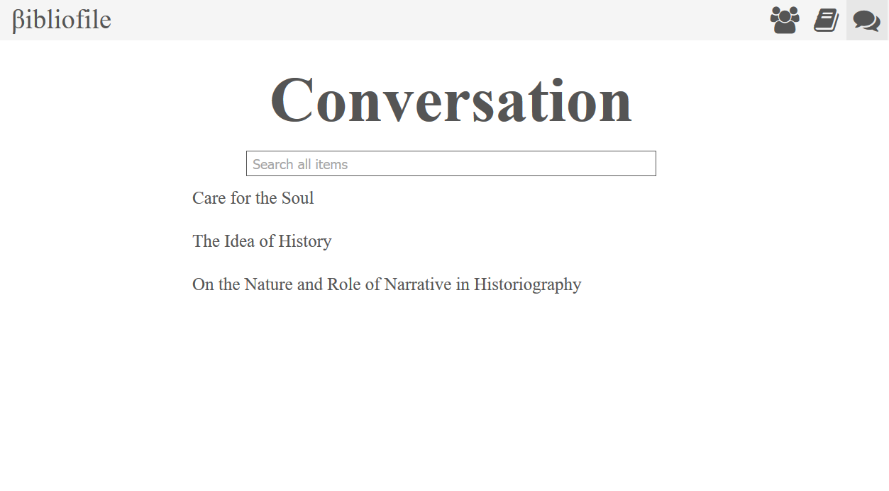

# Bibliofile

A wiki-style app to create the conversations between works.  The website allows you to create anyone who has produced something (e.g., poets, academic scholars, painters) as well as their works (e.g., journal articles, musical compositions, books) and interlink them when one references another.  For example, Tchaikovsky might exist as a creator, his "1812 Overture" as one of his works, and a review of his overture could be linked as a reference.

Building this list then allows you to discover the conversation surrounding any work of your choice.  However, if the conversation is too sparse, then that means more works and references need to be added.

## Technology

This project is built using jQuery, vanilla JavaScript, HTML, and CSS for the front-end.  The server is a Node Express app using Mongoose as the go-between for a Mongo database.

## Screenshots

List of creators

Creator page in edit mode

List of works

Work details

Conversation
